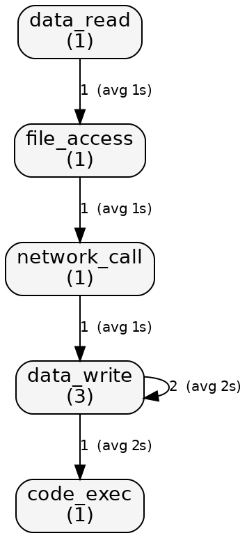

# Vectra Guard in a Mythos world

*Published April 2026*

On Monday, April 7, Anthropic previewed **Claude Mythos** — a frontier
model that autonomously finds and exploits high-severity software bugs
for under $2,000 of compute per exploit. The disclosures they showed off
were not subtle: a directed chain against the OpenBSD TCP SACK stack, an
H.264 decoder bug in FFmpeg, a guest-to-host escape in a Rust-based VMM,
and a 17-year-old root-level bug in FreeBSD's NFS server. Alongside
Mythos, they launched **Project Glasswing**, a 12-founder, 40-org
defender coalition with $100M in Anthropic credits that gates access so
defenders can get a head start before the capability becomes generally
available.

We build [Vectra Guard](https://github.com/xadnavyaai/vectra-guard), an
OSS security toolkit for AI agent workflows. Watching Monday's
disclosures, it became very clear that several assumptions Vectra Guard
had been quietly underwriting — and several assumptions the whole OSS
ecosystem has been quietly underwriting — need to be updated this week,
not next quarter.

This post walks through the shift, how Vectra Guard's existing surface
maps onto it, what we shipped in response this week, and (honestly) what
we don't cover.

## What changed for defenders

Three trust signals that engineers and maintainers used to rely on got
materially weaker on Monday.

**"This code is old and heavily reviewed, so it's probably fine."** The
FreeBSD NFS finding was a root-level bug that sat in production for 17
years. Age is not a defense. Directed semantic review from a capable
model is now cheap relative to human audit time, which means the
heavily-trafficked corners of stable codebases — the stuff nobody has
had a business reason to re-audit in five years — just moved from
"probably fine" to "first-class audit target." Your oldest, most-used
code is now the most interesting code.

**"This code is memory-safe, so the memory-safety bug class is gone."**
The Rust-based VMM escape is the clean wake-up call on this. It did not
bypass Rust's safety guarantees. It lived inside `unsafe {}` blocks —
exactly where the language expects to hand trust back to the developer.
A memory-safe language is a giant reduction in attack surface, but it
is not an elimination. Wherever a memory-safe project crosses into FFI,
`unsafe`, cgo, ctypes, JNI, or N-API, you have a hand-off of trust that
needs a real audit. The language cannot do that audit for you.

**"This code has fuzzing coverage, so the obvious bugs are caught."**
OpenBSD TCP SACK and FFmpeg H.264 are both heavily fuzzed. Fuzzing
catches what fuzzing is shaped like: inputs that look syntactically
valid but drive the program into an unhappy state. A model-driven
search is shaped differently. It can reason about protocol state
machines, attacker-controlled invariants, and "this branch is only
reachable if you lie about a header earlier." The overlap between
"what fuzzing catches" and "what Mythos-class search catches" is not
zero, but it is not 100% either, and Monday was the demonstration.

None of this means the sky is falling. It means the defender's day-to-
day looks a little different.

## What Vectra Guard already does that maps directly

Vectra Guard already sits in the defender's half of the post-Mythos
threat model. The existing surface was designed for agent safety, but
most of it lines up with the disclosures pretty cleanly:

- **`vg prompt-firewall`** — classifies untrusted text into low /
  medium / high risk before it reaches an agent's tool-calling loop.
  The threat here is prompt injection that turns a well-aligned agent
  into a well-aligned agent pointed at the wrong goal. Mythos-class
  capabilities raise the stakes on any injection that reaches a loop,
  because the loop can do more with less supervision.
- **`vg exec` + sandbox + seccomp** — runs risky commands inside an
  isolated environment. The Rust VMM finding is a reminder that "the
  sandbox is perfect" is the wrong mental model; "the sandbox limits
  the blast radius of an exploit you didn't know about" is the right
  one. Defense in depth, not defense in abstinence.
- **`vg cve scan` / `sync` / `explain`** — reads your manifests and
  lockfiles, queries OSV, and flags known-vulnerable packages before
  `npm install` (or `pip install`, or `go get`) gets to run. With the
  FreeBSD NFS story fresh, the "have I seen this CVE already?"
  question is worth asking at every dependency install, not just at
  release time.
- **`vg restore` (soft delete)** — agent-authored changes are faster
  and louder than they were a year ago. A 30-day safety net on file
  deletion is cheap insurance for a category of mistakes that
  are increasingly common.
- **`vg session` / `vg session-diff` / `vg audit session`** — every
  agent run leaves a structured, diffable audit trail. "What did my
  agent actually do" is a much more interesting question when the
  agent is more capable.

## The Rust VMM escape — and where to audit

The Rust VMM guest-to-host escape is the finding to stop and point at.
The chain did not bypass Rust's safety guarantees. It lived entirely
inside `unsafe {}` blocks, exactly where the language expects to hand
trust back to the developer. The place an audit has to happen is
therefore not "wherever Rust is used" — it's "wherever Rust hands
trust back." That is a much smaller, much more tractable surface, and
it did not exist as a first-class concept in most CI pipelines before
this week.

`vg scan boundaries`, shipped this week, is our answer. It walks a
repository and reports every trust boundary it can find, across six
languages: `unsafe` blocks / `fn` / `impl` / `trait` in Rust, `import
"C"` and `unsafe.Pointer` in Go, `ctypes.CDLL` and `cffi` in Python,
`ffi-napi` / `ref-napi` / native bindings in Node, `native` methods in
Java, and `dlsym` / `dlopen` / custom allocators in C/C++.

The scanner does not try to find bugs. It surfaces the places where a
bug — if there is one — will live. You cannot audit "the whole
codebase" in an afternoon. You can audit every `unsafe {}` block,
every cgo file, every N-API binding. The output is a map of places
that need a human review — nothing more.

```bash
vg scan boundaries --path .
```

## What shipped this week

We did a concurrent engineering + content push against the Mythos
threat model. Four feature PRs, all additive, all on rolling main.

**1. `promptfw` v2 — expanded detector suite for agent-era injection.**
The detector suite is up to 18 regex categories plus entropy, trigram,
base64, zero-width, and leetspeak obfuscation checks. The new version
also ships with a 108-prompt curated benchmark corpus checked into the
repo (`internal/promptfw/corpus/`, 56 malicious + 52 benign) and a
`--benchmark` flag that runs the detectors against the corpus and
prints the confusion matrix plus precision, recall, and F1. Current
baseline on the bundled corpus: **precision 0.943, recall 0.893,
F1 0.917** (TP=50, FP=3, FN=6, TN=49). A new [prompt firewall
reference page](../prompt-firewall.md) lists every detector and what
it catches.

**2. `vg scan boundaries` — audit FFI and unsafe surfaces.** Described
above. Six languages, narrow detector set by design.

**3. `vg cve freshness` + `vg cve scan --max-age-days N`.** Advisory
velocity is a live concern post-Mythos — a CVE cache that is 10 days
stale is a real exposure, not a hygiene issue. `vg cve freshness`
prints the local cache age, source list, entry count, and oldest /
newest entry timestamps. `vg cve scan --max-age-days N` hard-fails with
exit code 2 if the cache is older than N days. Wire the second one into
CI and the "I thought we were checking CVEs" class of bug goes away.

**4. `vg behavioral profile` — session action graphs.** Vectra Guard
already records what agents do. This release adds a structured view of
*how* they do it — a deterministic, category-level action graph you
can diff against another session.



*Above: the action graph Vectra Guard produces for a real session. Every
node is a category, every edge is a category-to-category transition
weighted by occurrence count and average inter-arrival gap. Rendered with:*

```bash
vg behavioral profile --session $SESSION --output dot | dot -Tpng > graph.png
```

The categorization is intentionally a closed set of eight buckets:
`data_read`, `data_write`, `file_access`, `code_exec`, `external_api`,
`network_call`, `auth_action`, `internal_compute`. Every command and
every file operation maps to exactly one category, and the graph is
just "which category follows which, with what edge weight and total
inter-arrival gap." The point of this v1 is not anomaly detection. The
point is that you can now ask, "does this run's behavioral shape look
like prior runs on similar tasks?" and get a concrete, diffable answer.

```bash
vg behavioral profile --session $SESSION --output json
```

Two sessions can also be diffed directly. If yesterday's run had a
clean file-access → code-exec shape and today's run suddenly has a
`network_call` node you did not expect, that is a structured,
reviewable signal — not a log you have to hand-read.

```bash
vg behavioral profile --session $TODAY --diff $YESTERDAY
```

In a later release an anomaly detector will consume this primitive.
This week we shipped the primitive itself — taxonomy, graph builder,
session adapter, CLI, cross-session `--diff`, and a Graphviz `dot`
exporter so you can render sessions like the one above for any run.

## Honest limits

Vectra Guard does not find bugs. It does not run directed semantic
analysis against your codebase. It does not produce exploits. If that
is what you need, Glasswing is the program that will (eventually) make
Mythos-class capability available to defenders, and your best
investment this week is getting on the application list.

Vectra Guard does not replace a real security team. Its goal is
narrower: keep AI agent workflows safe by default, surface the
surfaces that need a human audit, and leave an audit trail you can
diff after the fact.

## Five things to run this week

If you only have a coffee break, run these four commands and flip
one config key:

```bash
# 1. Audit the trust boundaries in your repo.
vg scan boundaries --path .

# 2. Refresh the CVE cache and fail fast if it's old.
vg cve sync --path .
vg cve scan --path . --max-age-days 7

# 3. Check the prompt firewall is tuned for your corpus.
vg prompt-firewall --benchmark

# 4. After any non-trivial agent run, profile the behavior.
vg behavioral profile --session $SESSION --output json
```

And one config change: turn the sandbox on for every agent
invocation. In `~/.config/vectra-guard/config.yaml`:

```yaml
sandbox:
  enabled: true
  mode: always
  enable_cache: true
```

The common thread: treat the agent's envelope the way you already
treat a junior engineer's commit. Review the boundaries, not the whole
codebase. Fail fast on known-bad state. Keep the audit trail. Look at
the shape of what happened before you merge.

None of this is hype. The cost of the defender's day-to-day just went
up a notch. The tools to cover that cost should be free, obvious, and
ship on rolling main. That is what Vectra Guard is for.
